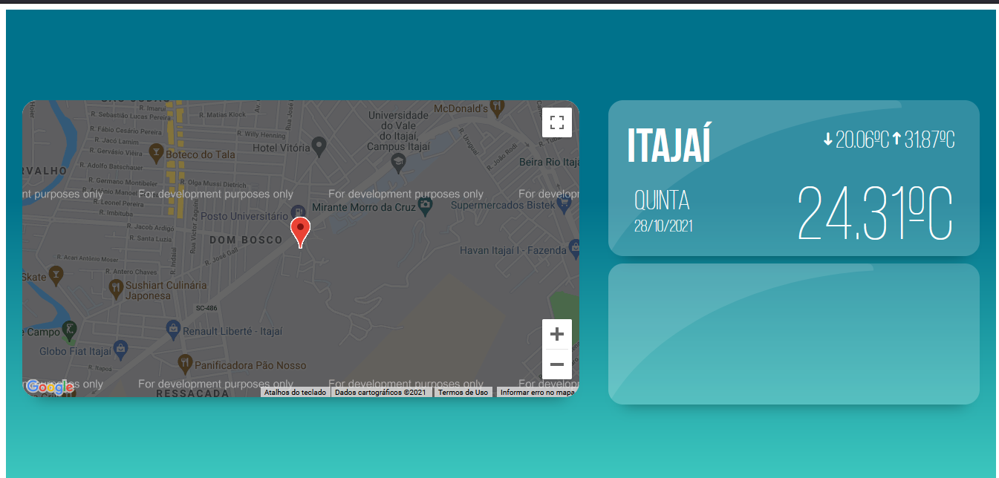

# Projeto de Aplicação de Sensores com Geolocalização e Temperatura
Trabalho realizado para a disiciplina de Tópicos Especiais em Integração Software Hardware. O objetivo do trabalho é explorar e entender mais sobre os sensores de geolocalização (GPS) e temperatura bem como a API do Google Maps.

Sensor de temperatura utilizado DS18B20.

